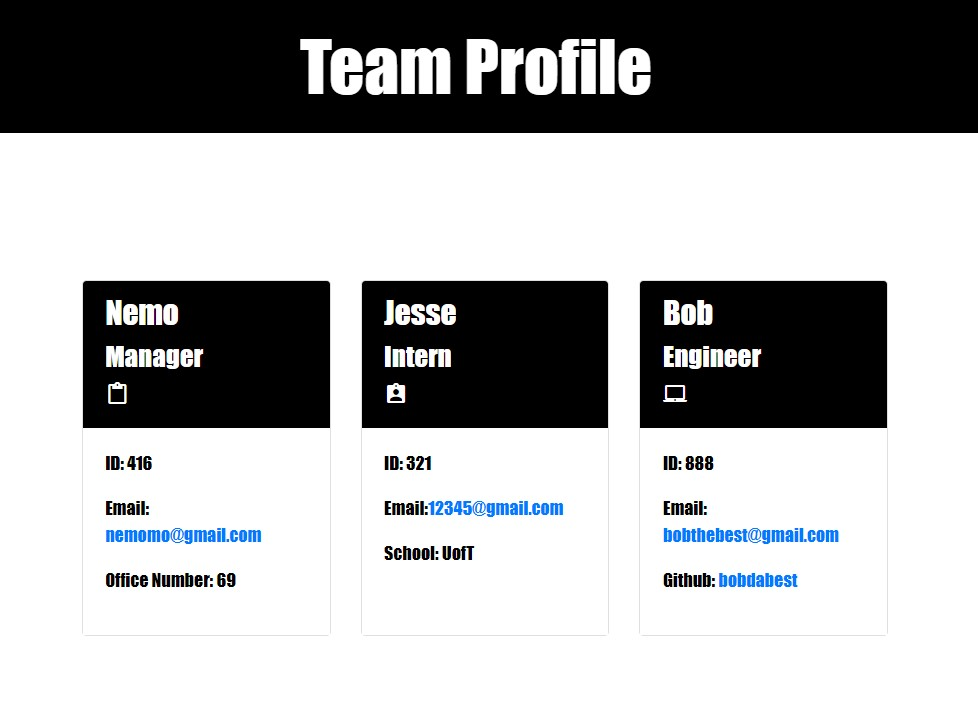

# TEAM PROFILE GENERATOR

## Description 
This application generates a team profile through users input using Inquirer displaying info on a html page with a style sheet.
 
## Table of Contents
* [Installation](#installation)
* [Usage](#usage)
* [Walkthrough](#walkthrough)
* [Screenshots](#screenshots)
* [License](#license)
* [Contributing](#contributing)
* [Tests](#tests)
* [Questions](#questions)

## Installation 
clone the repository from GitHub and download Node.
requires a file system and inquirer module. 
this application uses Jest for testing.

## Usage 
use inquirer to enter info

## Walkthrough
walk through video here - [Youtube Link](https://youtu.be/v5d3pK3VUWo)

## Screenshots

## License 
License with MIT

## Contributing 
Please read the installation section. 

## Tests
Run `npm test` to use Jest for testing 

## Questions
Feel free to ask any questions and contact me at wjy16888888@gmail.com. 
GitHup repo link https://github.com/chunngaimo/TEAM-PROFILE-GENERATOR.
